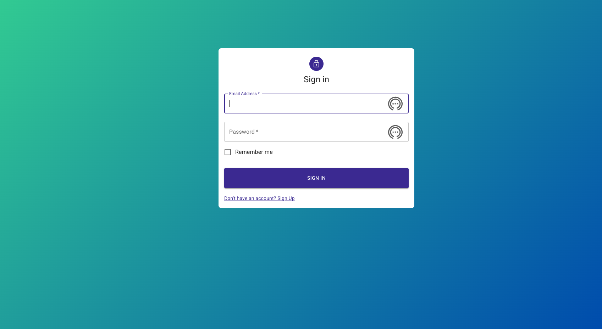
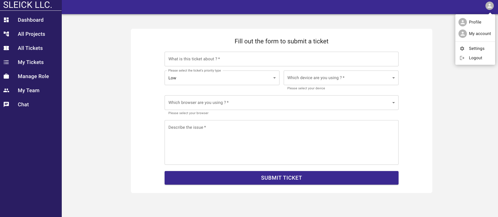

# Sleick Technologies

Sleick Technologies Application is designed to be a full stack application with a Node.Js and Express.Js backend, a React.Js front-end and MongoDB Database. The purpose of this application is to help IT support teams, Developer teams, customer support teams track and resolve tickets such as ones that would be submitted by end users. The app will be providing two portals, one for end users to manage and submit their tickets and the other for the support team. Additionally the application will have a built in chat feature for communication amongst team members.

## Preview

Login preview

New ticket submition preview

## Technologies utilized so far

Node.js, Express, MongoDB, bcrypt, JSON Web Token, dotenv, React.Js, Joi, Lodash, chart.js, Material-UI

## Get started

1 - Fork and clone the repo to your computer  
2 - CD into fronted and run npm install to install the dependencies then npm satart to lunch the project in your browser  
3 - CD into server and run npm install to install the dependencies then node index.js or nodemon to start the server

## The frontend

Users can't access any content without proper authentiction and authorization.
The main route http://localhost:3000/ will redirect the user to http://localhost:3000/user/login. On successful login, the user is redirected to the dashboard.

## Configurations

Create a file named .env in the server folder and set the values for these variables:

PORT= 9000  
MONGODB_URI="" paste in your mongodb connection string  
jwtPrivateKey="" create a private key

## API endpoints

1 - To create a new user, send a POST req to http://localhost:9000/api/users  
2 - To Login, send a POST request to http://localhost:9000/api/authn  
3- Get the current user (Protected route, requies authentication and authorization) http://localhost:9000/api/users/me
